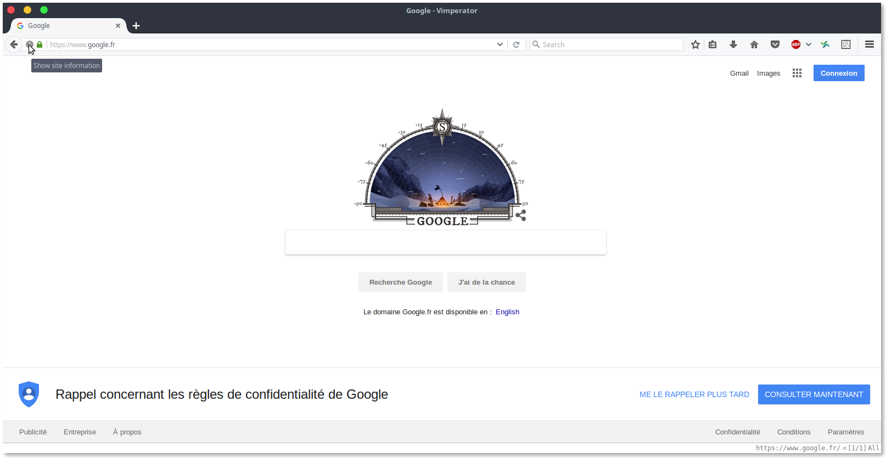
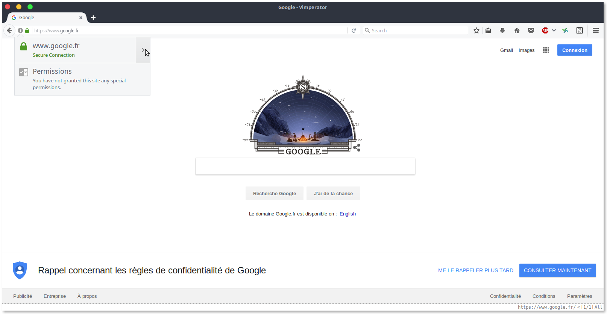
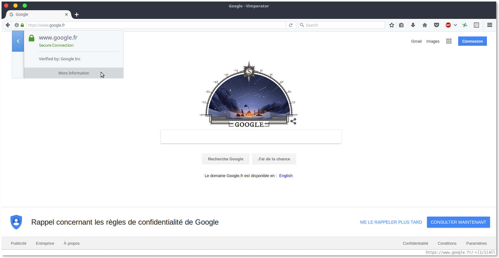
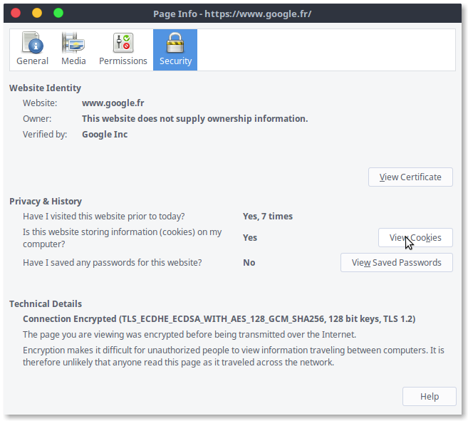
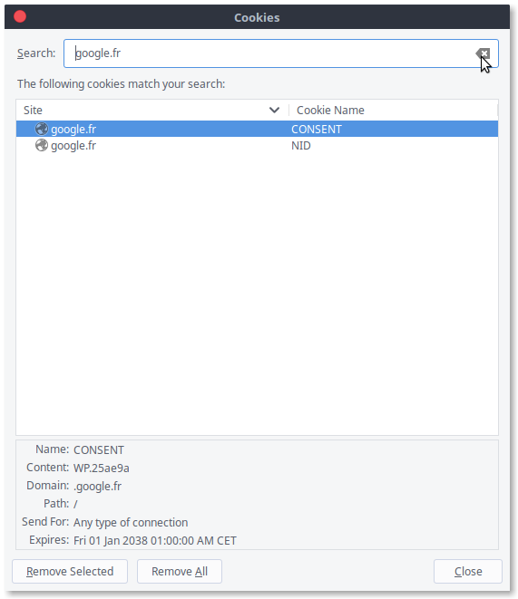

# TP3 - TP4 Sécurité des clients et serveurs web

## 1 Côté client

### Exercice 1 (Cookies)

Le navigateur fait 57 requêtes à [wikipedia](https://fr.wikipedia.org), sur 3
sous domaines différents. Sur TOR, nous n'avons aucun cookie de stocké, en 
revanche sur Firefox nous avons 4 cookies du domaine `fr.wikipedia.org` et 1 du 
domaine `wikipedia.org` :

* `fr.wikipedia.org`
    * **CP** : Contient la valeur `H2` mais aucune idée de ce que cela peut être.
    * **WMF-Last-Access** : Contient la date de dernier accès au site.
    * **frwikiGeoFeaturesUser2** : Contient une valeur hexadécimale
    * **frwikimwuser-sessionId** : Contient une valeur hexadécimale (avec le nom on 
      devine que c'est l'identifiant de session).
* `wikipedia.org`
    * **GeoIP** : Contient l'endroit depuis lequel on accède au site.

D'autres cookies sont disponibles pour le domaine `wikimedia.org`, 5 en tout 
dont les suivants les plus important :
    * **WMF-Last-Access** : Contient le dernier accès à la WMF (WikiMediaFoundation)
    * **GeoIP** : Contient l'endroit depuis lequel on accède au site.
    * **CP** : Contient la valeur `H2` mais aucune idée de ce que cela peut être.

Description des attributs des cookies :

* **secure** : Définie si le cookie ne doit être envoyé que sur du HTTPs car
  il contient des données confidentielles.
* **httpOnly** : Définie si le cookie est accessible à d'autre protocole que 
  HTTP. Par exemple si le cookie est disponible via JavaScript.
* **expires** : Date de fin de validité du cookie.

Pour complètement charger le site de la [fnac](http://www.fnac.com/), le 
navigateur effectue 153 requêtes sur notre navigateur.

#### Que signifie `Same Origin Policy` pour les cookies ?

Cela permet d'éviter qu'un site tiers utilise ou supprime notre cookie. Par 
exemple, un cookie mis en place sur un nom de domaine `login.site.com` n'est 
utilisable que sur le même sous domaine et le même nom de domaine.
C'est à dire que notre cookie mis en place sur `login.site.com` n'est utilisable
que sur `login.site.com` et `site.com` mais pas sur `other.site.com` ou 
`othersite.com`. Idem pour les ports : un cookie déposé sur le port 80 n'est 
utilisable que sur le port 80.

#### Chercher les requêtes sur le site `eultech.fnac.com`

11 requêtes mènent vers cette adresse, et ces requêtes sont principalement des
requêtes vers des outils de tracking.

#### Chercher dans le DNS à quoi correspond ce nom de domaine

```
~$ host eultech.fnac.com
eultech.fnac.com is an alias for fnac.eulerian.net.
fnac.eulerian.net is an alias for fc.eulerian.net.
fc.eulerian.net has address 109.232.194.121
```

#### A quoi correspondent les requêtes sur `its.tradelab.fr` ?

Ces requêtes correspondent principalement à des requêtes pour récupérer des 
images (GIF). Probablement pour utiliser la technique de l'image pixel.

#### A quoi correspondent les images sur `engage.commander1.com` ?

Une seule image est chargée. Elle permet à ce site de mettre un cookie dans 
l'entête de la réponse. Cette technique permet d'invoquer une image de taille
1px sur 1px qui permet de faire une requête invisible à Madame et Monsieur Michu
du Larzac, et qui permet de mettre un cookie traçant leur activité.

#### Que se passe-t-il si vous désactivez JavaScript ?

La navigation sur le site est compliquée. Beaucoup d'images n'apparaissent pas 
car celles-ci sont chargées grâce à des requêtes utilisant `XMLHttpRequest` qui 
est un object JavaScript.

#### Effectuez une recherche `sclient` sur Google, en remarquant qu'à chacune des lettres que vous tapez, une requête POST est envoyée à Google

A chacune des lettres que nous tapons, c'est une requête GET qui est envoyé, et 
pas une requête POST.

#### Quel est l'état de vos cookies sur www.google.fr ?

En accédant à `www.google.fr` nous avons 3 cookies qui apparaissent.

* **google.com NID** : 91=zIG8h9nyL7Qy1D4zKOzXngYdHzMAt0TxCNcJeoBz3Ub-PbAfijagoNPJ0JNXIkl67yet4mmN2QG6Qof-tXH59tNgD8BHpr_5LcWhJy1YayuTzP4enMgmRgEkn5xlkSUt
* **google.fr CONSENT** : WP.25ae9a
* **google.com NID** : 91=SyasiLK0QKXM7yepp5yyS4BqktpeYcKhWKel8Tawvvwbn5a_xId5WhciqBuaXbJyyxoZNcQb6KlZG2r8xhdXG9_SwcYFVaDqV3wnqDUztQjiqsqKB7TeJN_BTtmAAlCn

#### Quel est la procédure pour accéder au cookies ?

Nous utilisons Firefox et voici la procédure pour accéder aux cookies :







#### Quel est l'état de vos cookies sur www.amazon.fr ?

7 cookies apparaissent dès l'accès au site :

* **csm-hit** : s-G10PTD1677K49EJTV6FR|1481719770256
* **ubid-acbfr** : 253-2138915-4093901
* **session-id-time** : 2082754801l
* **session-id** : 254-0114311-6478971
* **x-wl-uid** : 1bqDVK64CYd0ZxpsDo0n/n+Utn/JfGzIY1zLtPQjYQFiR3aClDO0a0CE22Q2XoDFd3Y5ASKQeU/c=
* **session-token** : kekXziw6u3X6z92kSFxdC0VuZZe+/EyYiEWzOdaV9owWFTk5MjTsX5pNbLZZ41Q36+m7pUh7914ZvBlIcvwrIQYnK1BPf3sOvudanDtGcKlTdA48OjIRxcsGf6Cm/42Sm+/H5xjMhxNcpUNIbU/mRU8blkNciZYiHYoMzCqzNKc27QrdnIjVAfDyX8QDeMs05CRAveEGxot+qAPe8DVkb+OtpJdrSU6A74r4G2FPumP4ZktUje64yVw
* **JSESSIONID** : 0E7E15F8413E69C93E526A1F6379ED73

#### Testez le mode navigation privé sur vos navigateurs ? Quel est la différence ?

En mode navigation privée, les cookies et l'historique ne sont conservés, 
ce qui permet de naviguer tranquillement en évitant le pistage entre différentes
sessions de navigation.

Bien sur, cela n'augmente en rien la sécurité de l'utilisateur, mais minimise 
le tracking.

### Exercice 2 (Requêtes HTTP)

**Entête de la requête :**

```
GET / HTTP/1.1
Host: www.univ-rouen.fr
Connection: keep-alive
Cache-Control: max-age=0
Upgrade-Insecure-Requests: 1
User-Agent: Mozilla/5.0 (X11; Linux x86_64) AppleWebKit/537.36 (KHTML, like Gecko) Chrome/53.0.2785.143 Safari/537.36
Accept: text/html,application/xhtml+xml,application/xml;q=0.9,image/webp,*/*;q=0.8
DNT: 1
Accept-Encoding: gzip, deflate, sdch
Accept-Language: en-US,en;q=0.8,fr;q=0.6
Cookie: JSESSIONID=76BDF3BF3ABB6DC328837BEDCD3BC2AA; _pk_id.4.7430=1e74b8bce55573f2.1480523784.1.1480523784.1480523784.; _pk_ses.4.7430=*
```

On fait une requête `GET` (donc sans corps) sur la ressource racine `/` avec le 
protocole `HTTP/1.1` sur le domaine `www.univ-rouen.fr`. La connexion 
`keep-alive` permet de spécifier qu'avec cette seule requête la réponse peut 
être éparpillée sur plusieurs *chunk*. La requête indique également que l'on ne 
souhaite pas de `Cache-Control`, mais qu'on autorise la création avec un 
`max-age=0`. On aurait pu dire qu'on ne voulait absolument pas de cache avec 
la valeur `no-cache`. La requête envoie également le type de client sur lequel 
on se trouve `User-Agent`. Vient ensuite les types de données que l'on accepte, 
l'encodage et le langage préféré. La requête transmet également les cookies.


**Entête de la réponse :**
```
HTTP/1.1 200 OK
Date: Wed, 30 Nov 2016 16:36:29 GMT
Server: Apache
Connection: close
Transfer-Encoding: chunked
Content-Type: text/html
```

La requête vers [www.univ-rouen.fr](http://www.univ-rouen.fr) nous indique que 
la ressource demandée existe bien et que le protocole est en HTTP/1.1

> `HTTP/1.1 200 OK`

La ressource demandée nous indique la date de transmission de la réponse :

> `Date: Wed, 30 Nov 2016 16:36:29 GMT`

La ressource demandée nous indique le serveur qui envoie la réponse :
> `Server: Apache`

La ressource demandée nous indique si la réponse nécessite un flux de 
connexion :

> `Connection: close`

La ressource demandée nous indique si la réponse est transmise en plusieurs 
morceaux :

> `Transfer-Encoding: chunked`

La ressource demandée nous indique le type de contenu de la réponse :

> `Content-Type: text/html`

#### Que signifie l'en-tête `Location` ?

L'en-tête `Location` permet d'indiquer au navigateur depuis quelle URL nous 
avons été redirigé.

#### Connectez vous sur l'ENT, réessayer le site précédent, que se passe-t-il ?

On est directement redirigé vers l'ENT de Rouen.

#### Pourquoi allez vous directement sur le site fr.wikipedia.org en https ?

Une redirection est mise en place côté serveur pour que les connexions sur le 
port 80 (i.e. http) soient redirigées sur le port 443 (i.e. https).

#### Connexion sur GreenWeez. Que se passe-t-il ?

Le mot de passe est chiffré côté client pour être envoyé sur le serveur par la 
suite. C'est utile pour les sites qui ne sont pas en HTTPS pour que, au cas où 
le MITM intercepte le données de formulaire ne puisse pas voir le mot de passe 
en clair. C'est une stratégie risquée qui n'empêche pas d'avoir accès au site 
GreenWeez si on se trouve au milieu et que l'on intercepte le mot de passe.

#### Connexion sur DragonBleu. Que se passe-t-il ?

Le mot de passe apparait en clair dans la requête. Aucun chiffrement n'est 
effectué côté client et la connexion étant en http, le mot de passe apparait en 
clair.

#### Décrire les champs suivant :

* Referer : Le site sur lequel on était avant. 
* Accept-Language : Les langues accepté par le client.
* User-Agent : La description du client.
* Server : Le type de serveur qui fournit la réponse.
* Set-Cookie : Permet de mettre un cookies dans le navigateur
* Cookie : Permet d'envoyer les cookies au serveur.
* Strict-Transport-Security : Permet de dire au client qu'on force le HTTPS
* Access-Control-Allow-Origin : Permet d'éviter le Cross Origin Resource Sharing
* Access-Control-Expose-Headers : Permet d'indiquer que les headers sont sûr à exposer.
* X-Analytics : Permet un certain nombre de collecte de données.
* public-key-pins-report-only : Permet d'ajouter une sécurité supplémentaire pour ceux qui utilisent des certificats frauduleux.

### Exercice 3 (Vérification côté client)

La demonstration effectuée montre qu'il faut toujours respecter le principe 
NTUI (Never Trust User Input) côté serveur. Il faut toujours filtrer les données
que l'on reçoit d'une requête utilisateur, même si on fait des ajout de filtrage
au niveau du client. Les ajouts de filtrage côté client sont utiles pour l'UX
Design.

## 2 Côté serveur 

### Exercice 4 (TLS)

#### Sur quel protocole de sécurité est-il fondé ?

HTTPS est fondé sur le protocole TLS, autrement appelé SSL ou encode HTTP 
Secure.

#### Quel type de certificat est utilisé ?

Un certificat d'**authentification** émis pas une autorité tierce est mis en 
place. Cela garantit théoriquement la confidentialité des données échangées.

### Exercice 5 (Certificat serveur)

1. Rappeler le contenu d'un certificat numérique : à quoi correspondent les 
principales données en clair ? Que contient le dernier champ (Après "Algorithme
de signature des certificats") ?

<!-- TODO -->

### Exercice 6 (genpkey)

#### Qu'est ce qu'un certificat racine ?

<!-- TODO -->

#### Importez le certificat de votre autorité dans vos navigateurs en lui accordant votre confiance.
#### Décrivez la procédure d'importation propre à votre poste.

```
Settings -> HTTPS/SSL -> Manage certificates -> Authorities -> Import -> Trust All
```

Il suffit d'importer et de cocher les cases pour 

#### Détaillez les éléments présents dans le certificat

<!-- TODO -->
